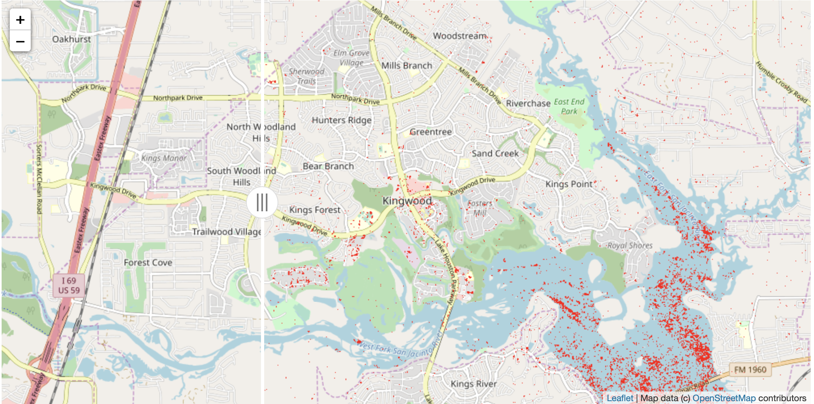

# gee-houston-flood
proof of concept using sentinel-1 radar and google earth engine python api to map floods after hurrican harvey 



## To run:

### Get an account with google earth engine and initialize access with a token. See here:
https://github.com/google/earthengine-api/blob/master/python/examples/ipynb/authorize_notebook_server.ipynb

### install conda if you don't already have it:
https://conda.io/miniconda.html

### install necessary packages into python environment (jupyterlab, ipyleaflet, gee-python-api):
```
conda env create -f environment.yml
conda activate gee-python-snowmelt
jupyter labextension install jupyter-leaflet
jupyter labextension install @jupyter-widgets/jupyterlab-manager
```

### run notebook in jupyter lab!
```
jupyter lab
```
